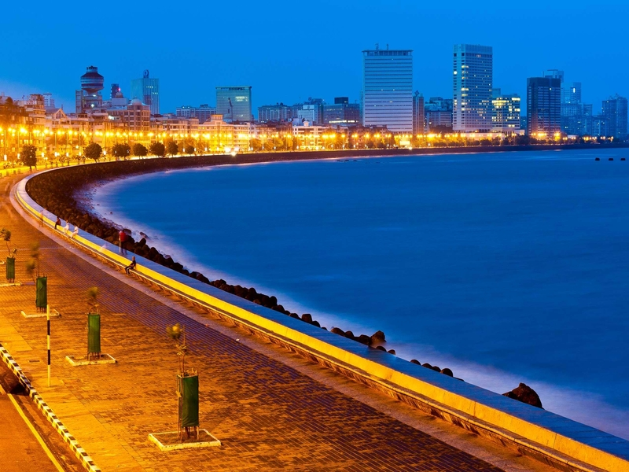
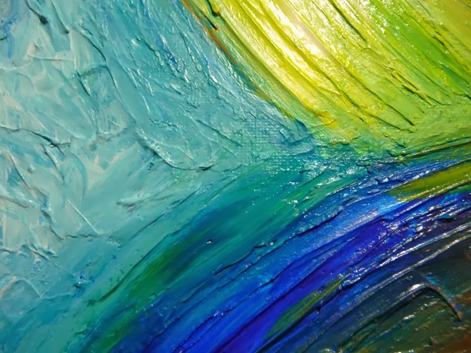
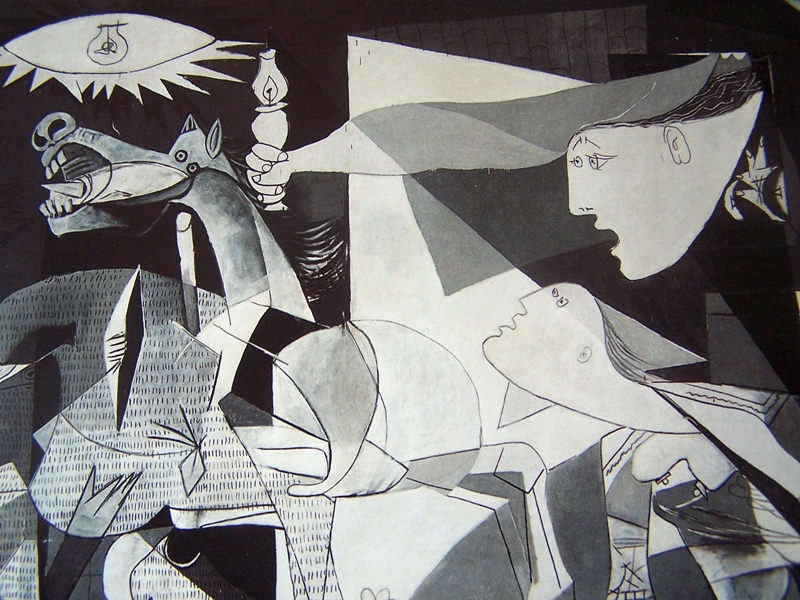
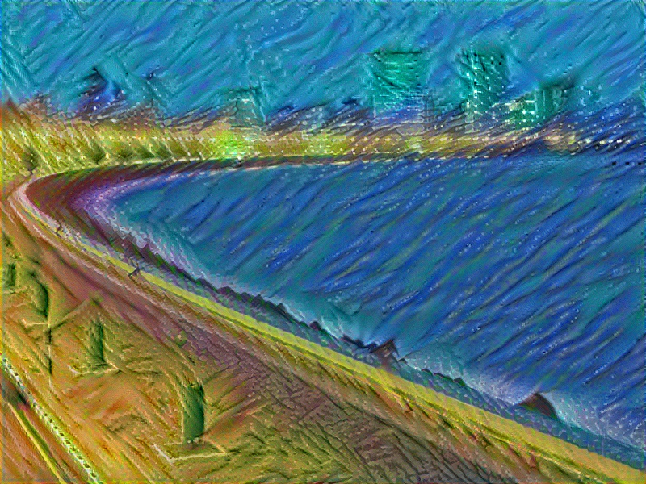
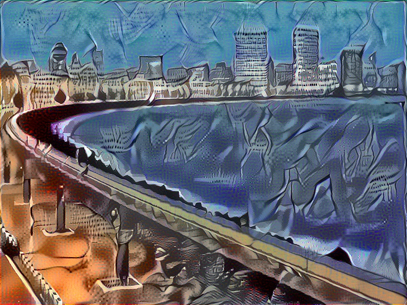
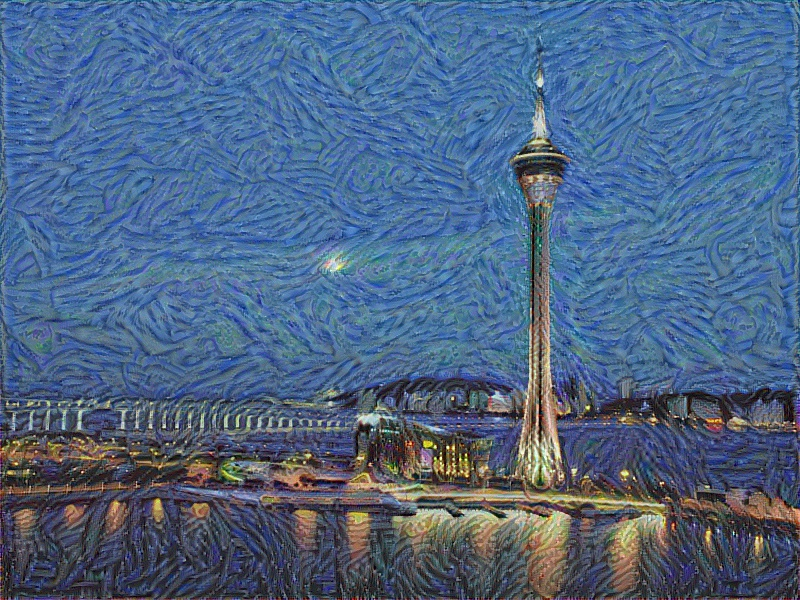
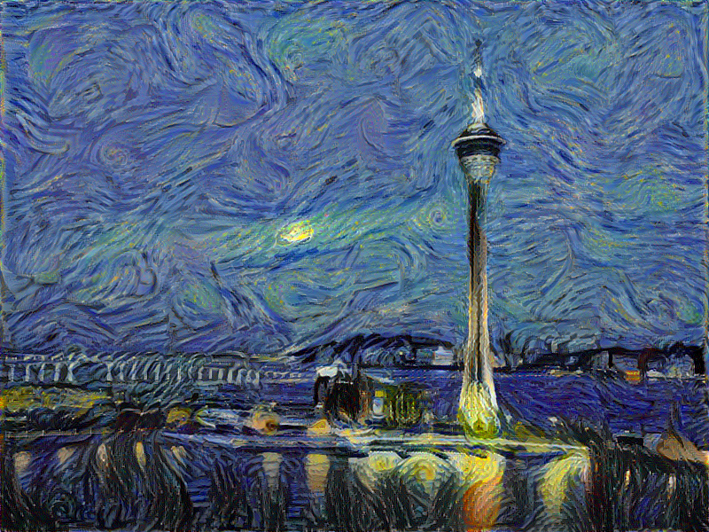

# Neural-Style-Transfer
This is an implementation of Neural Style Transfer using pretrained VGG19 model (can be found at http://www.vlfeat.org/matconvnet/models/imagenet-vgg-verydeep-19.mat)

The algorithm used for style transfer is based on Andrew Ng's Deep Learning Specialization course on Coursera.

For the content image:

And style image:

Generated image:

The generated image differs according to the control parameters like:

For example, generated image for <acau and StarryNight after 200 iterations vs 2000 iterations

